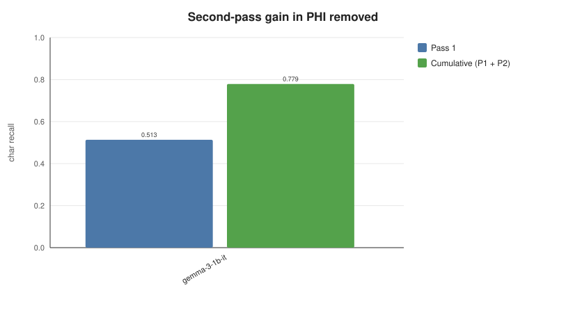
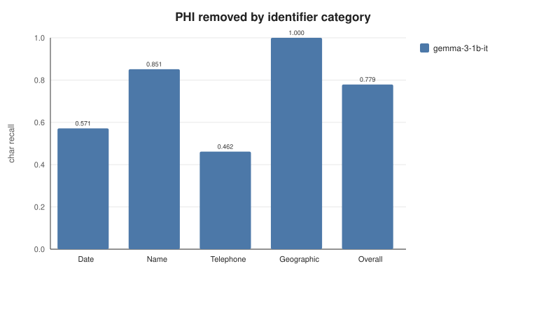
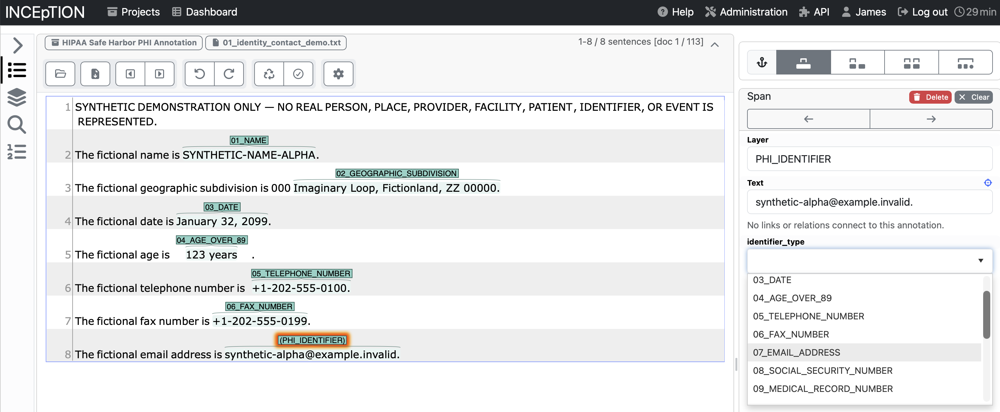

<div align="center">

# Clinical Text De-identification with Locally Deployed Open-Weight LLMs

**Companion evaluation and analysis code for**
*Clinical Text De-identification with Locally Deployed Open-Weight Large Language Models: A Real-World Evaluation of Discharge Notes*

Weatherhead, Cwiklik, McCaffrey, and Golovko

Manuscript being submitted to *Frontiers in Digital Health*.

[](#requirements)
[](LICENSE)
[](#quickstart)
[](#repository-scope)

</div>

This repository contains the **evaluation and analysis pipeline** used in the accompanying study. It converts a model's structured output into source-grounded, character-offset redactions and scores those redactions against expert gold annotations.

The code is published to make the computational methods inspectable, testable, and reusable. It is not a one-command reproduction of the published study because the real clinical notes, their gold annotations, and the model weights cannot be distributed with the repository.

> [!IMPORTANT]
> The study used real, IRB-approved discharge notes containing protected health information. Those notes and their expert annotations are not included. The repository instead ships a small **synthetic, PHI-free fixture** that exercises the same segmentation, inference, grounding, two-pass redaction, and scoring pipeline.

With the included fixture, you can:

* run a real local open-weight model through both redaction passes;
* reproduce the scorer's complete output schema;
* rebuild the ranked results table and analysis figures;
* swap in another evaluated model by changing one model path;
* run a dependency-free offline self-test with no model, GPU, or network.

## Contents

| Section                                                                             | Purpose                                                                      |
| ----------------------------------------------------------------------------------- | ---------------------------------------------------------------------------- |
| [Quickstart](#quickstart)                                                           | Run Gemma 3 1B locally over the PHI-free fixture and score the result.       |
| [Repository scope](#repository-scope)                                               | See what is included and what must be supplied for real-data reproduction.   |
| [Repository layout](#repository-layout)                                             | Locate the pipeline, protocol, fixtures, scripts, tests, and documentation.  |
| [How the pipeline works](#how-the-pipeline-works)                                   | Follow segmentation, extraction, grounding, two-pass redaction, and scoring. |
| [Run another model or corpus](#run-another-model-or-corpus)                         | Change models, use your own notes, or adapt the launcher to other hardware.  |
| [Reproduce the study on real data](#reproduce-the-study-on-real-data)               | Supply the restricted study inputs and rerun the evaluation.                 |
| [Prepare gold annotations with INCEpTION](#prepare-gold-annotations-with-inception) | Create gold annotations in the exact format consumed by the scorer.          |
| [Outputs and PHI handling](#outputs-and-phi-handling)                               | Understand generated files and which artifacts may contain PHI.              |
| [Models evaluated](#models-evaluated)                                               | Review all 17 evaluated checkpoints and their Hugging Face repositories.     |
| [Data availability](#data-availability)                                             | Review the restrictions on the clinical corpus and gold annotations.         |

## Requirements

The pipeline, scorer, figure scripts, and tests require **Python 3.9 or newer** and use only the Python standard library.

A real model evaluation additionally requires a local [`llama-server`](https://github.com/ggml-org/llama.cpp) instance from `llama.cpp`.

| Component                            | Requirement                                                       |
| ------------------------------------ | ----------------------------------------------------------------- |
| Pipeline, scorer, figures, and tests | Python 3.9+; no third-party Python packages                       |
| Real local inference                 | `llama-server` hosting a compatible GGUF model                    |
| Quickstart hardware                  | Apple Silicon Mac, M1 or newer, with at least 8 GB unified memory |
| Quickstart model                     | Gemma 3 1B, Q8_0, 1.07 GB                                         |

The commands below use `python3`, the standard interpreter name on macOS and most Linux distributions. On Windows, the command is usually `python`.

Installation of the Python package is optional. Every example prefixes commands with `PYTHONPATH=src`, so the repository runs directly from a checkout. Alternatively:

```bash
pip install -e .
```

This makes the `deid` package importable without the `PYTHONPATH` prefix and installs the `deid-run` and `deid-score` console commands.

The `make` targets are convenience wrappers around the same Python commands. `make` is not required.

## Quickstart

The following four steps clone the repository, install `llama.cpp`, download the smallest model evaluated in the study, run both redaction passes over the three synthetic notes, score the predictions, print the ranked table, and render the result figures.

These commands target **Apple Silicon Macs**. Other platforms use the same pipeline but may require a different `llama.cpp` build or server launch configuration; see [Other hardware](#other-hardware).

### 1. Clone the repository

```bash
git clone https://github.com/JamesWeatherhead/local-llm-deid.git
cd local-llm-deid
```

### 2. Install llama.cpp and the Hugging Face CLI

```bash
brew install llama.cpp
pip install -U "huggingface_hub[cli]"
```

### 3. Download Gemma 3 1B

Download the 1.07 GB Q8_0 GGUF into `models/gemma-3-1b-it/`:

```bash
huggingface-cli download ggml-org/gemma-3-1b-it-GGUF \
    gemma-3-1b-it-Q8_0.gguf --local-dir models/gemma-3-1b-it
```

### 4. Run the complete pipeline

```bash
scripts/run_local_end_to_end.sh \
    --gguf models/gemma-3-1b-it/gemma-3-1b-it-Q8_0.gguf \
    --model-id gemma-3-1b-it
```

The script:

1. starts `llama-server`;
2. runs Pass 1 and Pass 2 over the synthetic fixture;
3. scores the predictions against the fixture gold annotations;
4. prints the ranked results table;
5. renders the result figures;
6. stops the server.

On an Apple Silicon laptop, the three-note run finishes in well under a minute and produces character recall of approximately **0.78** at approximately **0.86 precision**.

All generated artifacts are written under `out/`:

```text
out/
├─ metrics_long.csv                    every metric, one row per pass × cohort × PHI type
├─ per_doc_long.csv                    per-note counts used by bootstrap_ci.py
├─ predictions/
│  └─ gemma-3-1b-it/                   resolved predictions and validation artifacts
└─ figures/
   ├─ figure2.svg ... figure6.svg       generated result figures
   └─ figure2.csv ... figure6.csv       plotted values for each figure

Exact example paths:

- `out/metrics_long.csv`
- `out/per_doc_long.csv`
- `out/predictions/gemma-3-1b-it/`
- `out/figures/figure2.svg` through `out/figures/figure6.svg`
```

Because `--model-id gemma-3-1b-it` matches `model_configs/gemma-3-1b-it.json`, the ranked table automatically includes the model's parameter count and Hugging Face link.

Use `--model-config PATH` to override the default metadata file. On real data, add `--strip-raw-content` to prevent verbatim model responses from being retained under `out/`.

You may also let the script download the model weights directly:

```bash
scripts/run_local_end_to_end.sh \
    --hf-repo ggml-org/gemma-3-1b-it-GGUF \
    --hf-file gemma-3-1b-it-Q8_0.gguf
```

Run the following command to see all available flags, including host, port, context size, GPU layers, model metadata, and output directory:

```bash
scripts/run_local_end_to_end.sh --help
```

### Optional: bootstrap confidence interval

Reproduce the 95% confidence interval for PHI removed from the per-note counts generated by the run:

```bash
python3 scripts/bootstrap_ci.py --per-doc out/per_doc_long.csv
```

The script resamples notes with replacement, recomputes pooled recall for each draw, and reports the 2.5th and 97.5th percentiles using 10,000 resamples and seed `20260801`.

On the three-note fixture, the interval is only a runnable demonstration. When pointed at the full study's `per_doc_long.csv`, the script reproduces the manuscript's confidence-interval method.

## Repository scope

### Included in this repository

* The study's segmentation, grounding, resolver, two-pass redaction, and scoring logic as standalone modules under `src/deid/`.
* The frozen system prompt, user prompt template, and model-output JSON schema under `protocol/`.
* A three-note synthetic fixture with gold annotations under `fixtures/synthetic/`.
* The scorer that re-derives every reported metric from gold annotations and resolved predictions.
* Scripts that rebuild the ranked results table, checkpoint table, corpus table, confidence interval, and analysis figures.
* Per-model metadata for all evaluated checkpoints under `model_configs/`.
* A manuscript-to-code map under `docs/MANUSCRIPT_MAP.md`.
* Offline unit and end-to-end tests under `tests/`.

### Not included

* The real 100-note clinical corpus.
* The expert gold annotations for the real corpus.
* Model weights.
* The manuscript's published figure images.

### Manuscript analyses not reproduced here

A few analyses reported in the manuscript are outside this repository's scope: the inter-annotator agreement statistics, the Microsoft Presidio baseline, the reasoning-recurrence ("looping") analysis, and the per-note timing medians. Each depends on inputs that are not distributed here (the annotators' independent markups, or the models' retained reasoning traces) or on a separate third-party system. The manuscript's reported numbers are also the mean of three independent runs, whereas this runner scores one temperature-0 run at a time. Each is mapped to the code in [`docs/MANUSCRIPT_MAP.md`](docs/MANUSCRIPT_MAP.md).

> [!NOTE]
> This is companion evaluation and analysis code, not a bundled clinical dataset and not a turnkey reproduction of the published numerical results.

To reproduce the published results, you must supply:

1. notes and gold annotations in the documented formats;
2. the GGUF weights for each evaluated model;
3. a running `llama-server` instance;
4. the same model and runtime configuration used by the study.

See [Reproduce the study on real data](#reproduce-the-study-on-real-data) for the complete workflow.

## Repository layout

```text
.
├─ src/deid/                           pipeline, inference back ends, two-pass runner, and scorer
│  ├─ pipeline.py                      segmentation, grounding, mapping, and redaction
│  ├─ inference.py                     llama-server client and offline test stub
│  ├─ run_model.py                     runs one model over the notes: Pass 1, Pass 2, redact
│  └─ metrics.py                       re-derives every metric from gold and predictions
├─ protocol/                           frozen system prompt and model-output JSON schema
├─ fixtures/synthetic/                 three synthetic notes and gold annotations; PHI-free
├─ scripts/
│  ├─ run_local_end_to_end.sh          serve a model, run, score, build table, and render figures
│  ├─ make_results_table.py            ranked results table; manuscript Table 3
│  ├─ make_figures.py                  analysis charts as SVG and CSV
│  ├─ make_checkpoints_table.py        checkpoint table; manuscript Table 2
│  ├─ make_corpus_table.py             corpus table; manuscript Table 1
│  └─ bootstrap_ci.py                  95% confidence interval for PHI removed
├─ model_configs/                      model metadata: parameters, quantization, size, and repository
├─ tests/                              offline end-to-end test and pipeline invariants
├─ docs/
│  ├─ MANUSCRIPT_MAP.md                maps manuscript artifacts and metrics to exact code paths
│  └─ images/                          methods figure, workflow figure, and INCEpTION screenshots
├─ DATA_DICTIONARY.md                  definitions for all 69 metrics_long.csv columns
└─ Makefile                            offline entry points: figures, tables, tests, and all
```

## How the pipeline works

The implementation follows the manuscript. All deterministic text operations use Unicode codepoints and half-open `[start, end)` offsets relative to the source note.

![Panel B of the study workflow figure (manuscript Figure 1): the evaluation in two branches. In one, two reviewers independently marked PHI in INCEpTION and reconciled their annotations into the reference standard. In the other, each model processed the same discharge note locally: segment into 3,500-character windows with 400-character overlap, Pass 1, redact, segment again, Pass 2, final redaction. The two branches are then compared at the character and entity level. The figure is a schematic and contains no PHI.](docs/images/methods-pipeline.png)

*Panel B of the manuscript's study workflow figure, Figure 1. The development-set selection panel is omitted. All displayed text is synthetic.*

### 1. Segmentation

Each note is divided into fixed windows of 3,500 Unicode codepoints with 400 codepoints of overlap. The overlap preserves identifiers that fall near a segment boundary by ensuring they appear intact in a neighboring segment.

Implementation: `pipeline.fixed_segments`

### 2. Structured extraction

Each segment is sent to the model with the frozen system prompt and strict JSON schema. The model returns a list of:

```json
{
  "exact_text": "...",
  "identifier_type": "..."
}
```

The identifier types are drawn from the 18 HIPAA Safe Harbor categories. Decoding is greedy and reproducible: temperature `0`, seed `42`, and `reasoning_effort` set to `low`.

Implementation: `src/deid/inference.py`

### 3. Validation and grounding

A returned pair is accepted only when:

* `exact_text` is a non-empty string;
* the text occurs verbatim in the segment;
* `identifier_type` is valid.

Every accepted literal is then located at every occurrence in the source note and converted to source offsets. The resolver performs no fuzzy matching and no normalization.

Implementations: `pipeline.validate_response`, `pipeline.resolve_pairs`

### 4. Two-pass detection

Pass 1 runs over the original note.

For Pass 2, the pipeline replaces every Pass-1 region with the neutral marker `[PHI]`, segments the redacted note, and sends those segments through the same extraction protocol. New findings are mapped back to source-note coordinates.

A Pass-2 match is dropped when it crosses a `[PHI]` marker because it cannot map to a single contiguous source span. New Pass-2 findings are applied only when every Pass-2 segment for that note completes cleanly.

The cumulative prediction set is:

```text
Pass 1 predictions ∪ applied Pass 2 predictions
```

Implementation: `run_model.process_document`

### 5. Redaction

The scored de-identified note replaces each predicted region with `[PHI]`. A category-labeled rendering is also available for inspection.

Implementations: `pipeline.neutral_redaction`, `pipeline.typed_redaction`

### 6. Scoring

The scorer reads only:

* the gold JSON annotations; and
* each model's `resolved_predictions.json` file.

The resolved predictions contain offsets and types, not identifier text. From these inputs, the scorer recomputes character-, span-, note-, and reliability-level metrics.

The headline PHI-removal metric is **character recall**. It is type-agnostic: a gold PHI character counts as removed when it is covered by any predicted redaction, regardless of the predicted category.

Metrics are reported across:

* two prediction stages: `pass1` and `cumulative_pass2`;
* two cohorts: `all_expected` and `operational_complete`;
* every HIPAA Safe Harbor type represented in the data;
* micro-averaged results by default, with macro variants alongside.

Implementation: `src/deid/metrics.py`

![Supplementary Figure S1: how each discharge note is segmented, redacted, and processed a second time, in three panels. Panel A splits a synthetic note into overlapping 3,500-character segments, where neighbouring segments repeat 400 characters so an identifier near a boundary appears in both. Panel B shows the same local model reviewing each segment and returning the exact identifier text and category as a structured response. Panel C shows the deterministic steps that locate the returned text, merge duplicate or overlapping detections, and redact after Pass 1; the redacted note is then segmented and reviewed again, and Pass-2 detections are mapped back and added to Pass 1 (Pass 2 can add a redaction but never reverse one). All text shown is synthetic and the figure contains no PHI.](docs/images/segment-workflow.png)

*Supplementary Figure S1 from the manuscript. Panel A shows segmentation, Panel B shows local-model extraction, and Panel C shows deterministic reassembly, redaction, and the second pass. All displayed text is synthetic.*

### Change the segmentation window and overlap

The study used a 3,500-codepoint window with 400 codepoints of overlap. These defaults are defined as `SEGMENT_SIZE` and `SEGMENT_OVERLAP` near the top of [`src/deid/pipeline.py`](src/deid/pipeline.py#L74-L80).

The synthetic notes are only a few hundred codepoints long, so each fits within one segment and the overlap is not exercised. Windowing becomes visible on full-length clinical notes.

Override the defaults for a run with `--segment-size` and `--overlap`:

```bash
PYTHONPATH=src python3 -m deid.run_model \
    --model-id gemma-3-1b-it \
    --notes-dir fixtures/synthetic/notes \
    --out-dir out/predictions \
    --protocol-dir protocol \
    --api-base http://127.0.0.1:8081 \
    --segment-size 3500 \
    --overlap 400
```

You may also edit `SEGMENT_SIZE` and `SEGMENT_OVERLAP` directly in `src/deid/pipeline.py`.

## Run another model or corpus

### Use another evaluated model

Any model listed under [Models evaluated](#models-evaluated) can be substituted without changing the pipeline. Download the corresponding GGUF, then change only the `--gguf` path and `--model-id`.

For example, to run Gemma 3 4B:

```bash
huggingface-cli download unsloth/gemma-3-4b-it-GGUF \
    gemma-3-4b-it-Q8_0.gguf --local-dir models/gemma-3-4b-it

scripts/run_local_end_to_end.sh \
    --gguf models/gemma-3-4b-it/gemma-3-4b-it-Q8_0.gguf \
    --model-id gemma-3-4b-it
```

Larger models generally require approximately their on-disk size in free memory, plus runtime headroom. Each single `*.gguf` file is a complete model checkpoint. Consult the linked Hugging Face repository for available quantizations and exact filenames.

### Run your own notes

Point the end-to-end script at your notes and gold annotations with `--notes-dir` and `--gold-dir`:

```bash
scripts/run_local_end_to_end.sh \
    --gguf models/gemma-3-1b-it/gemma-3-1b-it-Q8_0.gguf \
    --model-id gemma-3-1b-it \
    --notes-dir /path/to/notes \
    --gold-dir /path/to/gold \
    --strip-raw-content
```

The required input formats are documented under [Reproduce the study on real data](#reproduce-the-study-on-real-data). The `--strip-raw-content` flag is strongly recommended for real clinical data because it removes generated text from retained raw-response artifacts without changing any metric.

### Other hardware

The end-to-end script is configured for Apple Silicon. It offloads all model layers to Metal with `--n-gpu-layers 999` and assumes a Homebrew installation of `llama.cpp`.

On other systems:

* **CPU only:** use `--n-gpu-layers 0`; inference will be slower, but no GPU is required.
* **NVIDIA GPU:** build `llama.cpp` with CUDA support and offload layers to the GPU.
* **Other accelerators or operating systems:** adapt only the `llama-server` installation and launch flags.

The components chained by the script are platform-independent:

* `llama-server`;
* `deid.run_model`;
* `deid.metrics`.

Only the server launch line is hardware-specific. A collaborator comfortable with code can retarget `scripts/run_local_end_to_end.sh`, and coding assistants such as Claude Code or Codex can adapt it to a specific machine.

## Result figures

`scripts/make_figures.py` converts `out/metrics_long.csv` into self-contained SVG charts and a CSV containing the plotted values for each chart.

The generated charts cover the analyses presented as manuscript Figures 2 through 6. They use the same metric definitions and the same cumulative two-pass, all-expected-notes view, but they are drawn in this repository's own chart style.

> [!CAUTION]
> These are not the manuscript's published figure images. The examples below show one model evaluated on the three-note synthetic fixture. The manuscript figures show all 17 models evaluated on the real clinical corpus. The analysis definitions are shared; the appearance and numerical values are not.

Committed example renders are stored under `docs/images/figures/`.



*Second-pass gain for Gemma 3 1B on the synthetic fixture. Character recall increases from 0.513 after Pass 1 to 0.779 after the cumulative two-pass run, a gain of 0.266. This is the repository's rendering of the analysis reported as manuscript Figure 5, not the published figure.*



*Character recall by PHI category for Gemma 3 1B on the synthetic fixture: Date 0.571, Name 0.851, Telephone 0.462, Geographic 1.000, and Overall 0.779. This is the repository's rendering of the analysis reported as manuscript Figure 6, not the published figure.*

## Synthetic fixture and offline self-test

Every numerical result reported in the study came from a real local model. The repository also includes a deterministic offline test stub so the entire pipeline can be validated without model weights, a GPU, or a network connection.

The stub is a small pattern matcher used only as test scaffolding. It is not an evaluated de-identification system.

```bash
make selftest    # run the stub over the fixture, score it, and print the table
make figures     # render figures from the scored output
make test        # run the unit and end-to-end suite with python3 -m unittest
```

The stub targets names from a small gazetteer, dates, ages, telephone numbers, email addresses, and medical record numbers. It deliberately ignores geographic subdivisions.

Its fixed, hand-checkable fixture result is:

* character recall: `0.755`;
* character precision: `1.0`;
* completely clean notes: `1` of `3`.

`fixtures/synthetic/README.md` contains the complete per-type breakdown. `tests/test_end_to_end.py` asserts each expected value.

## Reproduce the study on real data

The Quickstart validates the complete workflow on synthetic notes. Reproducing the manuscript's published numerical results requires the original study inputs, none of which are distributed in this repository.

### Required inputs

1. **Clinical notes**
   A directory of UTF-8 `<doc-id>.txt` files, one note per file.

2. **Gold annotations**
   One PubAnnotation-format JSON file per note, loaded by `metrics.load_gold`. The exact format is documented under [Prepare gold annotations with INCEpTION](#prepare-gold-annotations-with-inception) and demonstrated under `fixtures/synthetic/gold/`.

3. **Model weights**
   One GGUF file for each model to be evaluated. The corresponding Hugging Face repositories are listed under [Models evaluated](#models-evaluated).

4. **Local inference server**
   A [`llama-server`](https://github.com/ggml-org/llama.cpp) instance hosting one model at a time through its OpenAI-compatible endpoint.

### Run one model, then score all models together

```bash
# Start the server for one model. Adjust flags for your llama.cpp build and hardware.
llama-server -m gemma-4-31B-it-Q5_K_M.gguf \
    --port 8081 \
    --ctx-size 8192

# Run that model over a directory of real <doc-id>.txt notes.
PYTHONPATH=src python3 -m deid.run_model \
    --model-id gemma-4-31B-it \
    --notes-dir /path/to/notes \
    --out-dir out/predictions \
    --protocol-dir protocol \
    --api-base http://127.0.0.1:8081

# Repeat for each model, always using the same out/predictions root, then score all runs.
PYTHONPATH=src python3 -m deid.metrics \
    --pred-dir out/predictions \
    --gold-dir /path/to/gold \
    --out-dir out
```

`scripts/run_local_end_to_end.sh` wraps the start-server, run-model, and score sequence for one checkpoint. Pass `--notes-dir` and `--gold-dir` to use the real corpus instead of the fixture.

### Model metadata

Pass a model configuration file so the results include developer, parameter count, architecture, medical specialization, quantization, on-disk size, and the Hugging Face repository:

```bash
--model-config model_configs/<model-id>.json
```

Ready-made configuration files for every evaluated checkpoint are stored under `model_configs/`. The generation script is `model_configs/build_configs.py`.

The runner copies the selected configuration next to the model's prediction output. The scorer reads the copied configuration when it builds the result manifests and tables. If no model configuration is supplied, the metadata columns remain blank.

### Reliability and determinism

The runner issues every request exactly once and records the raw response envelope, finish reason, and token usage. The reliability metrics therefore reflect the requests that actually completed.

The study evaluated every model with `llama.cpp` on one Apple M4 Max with 48 GB unified memory and Metal acceleration. Inference used temperature `0`, seed `42`, and constrained JSON output. The manuscript reports the mean of three independent runs, whose outputs were nearly byte-identical.

This repository's runner scores one run at a time. At temperature `0`, per-run differences are minimal, but model-layer determinism can still depend on the server build and hardware. The segmentation, grounding, redaction, and scoring code is fully deterministic.

The manuscript's 95% confidence interval for PHI removed comes from resampling notes, not rerunning models. Reproduce that interval from the per-note counts with `scripts/bootstrap_ci.py`.

## Prepare gold annotations with INCEpTION

The study's reference annotations were created with [INCEpTION](https://inception-project.github.io), an open-source platform for machine-assisted, knowledge-oriented interactive text annotation that can run locally.

To score your own notes, annotate them in INCEpTION and export each completed document in the JSON format consumed by the scorer.

### What you need

* A local INCEpTION instance. Download and setup instructions are available from the [INCEpTION project site](https://inception-project.github.io).
* Clinical notes as UTF-8 `.txt` files, imported into an INCEpTION project with one document per note.
* A custom span layer named `PHI_IDENTIFIER`.
* A layer feature named `identifier_type`.
* A tagset containing the [18 HIPAA Safe Harbor identifier categories](https://www.luc.edu/its/aboutus/itspoliciesguidelines/hipaainformation/the18hipaaidentifiers/), encoded as `01_NAME`, `02_GEOGRAPHIC_SUBDIVISION`, `03_DATE`, and so forth through category 18.

### Annotate the notes

Open each document, highlight every PHI span, and select its Safe Harbor category from the `identifier_type` field. The study used this same layer and tagset to create the gold reference standard.



### Export the annotations

From the INCEpTION toolbar, export each completed document as:

```text
PubAnnotation Document with Annotations (JSON)
```

This is the exact structure loaded by the scorer. Complete PHI-free examples are available under `fixtures/synthetic/gold/`.


### Expected JSON structure

Each note has one JSON file containing:

* `text`: the source note;
* `denotations`: PHI spans on the `PHI_IDENTIFIER` layer;
* `attributes`: the `identifier_type` attached to each span.

Offsets are Unicode codepoints. The interval is half-open: `begin` is inclusive and `end` is exclusive.

An abbreviated example follows. See `fixtures/synthetic/gold/TEST001.json` for a complete file.

```json
{
  "sourcedb": "synthetic-fixture",
  "sourceid": "TEST001",
  "text": "Discharge Summary\nPatient: John Archer    MRN: AB-102938\n... (full note text) ...",
  "denotations": [
    {
      "id": "T1",
      "obj": "PHI_IDENTIFIER",
      "span": { "begin": 27, "end": 38 }
    },
    {
      "id": "T2",
      "obj": "PHI_IDENTIFIER",
      "span": { "begin": 47, "end": 56 }
    }
  ],
  "attributes": [
    {
      "id": "A1",
      "subj": "T1",
      "obj": "01_NAME",
      "pred": "identifier_type"
    },
    {
      "id": "A2",
      "subj": "T2",
      "obj": "09_MEDICAL_RECORD_NUMBER",
      "pred": "identifier_type"
    }
  ]
}
```

The scorer loads this structure through `metrics.load_gold`. The `text` field is the reference string to which all offsets apply.

### Cite INCEpTION

When using INCEpTION, cite:

> Klie, J.-C., Bugert, M., Boullosa, B., Eckart de Castilho, R., and Gurevych, I. (2018). The INCEpTION Platform: Machine-Assisted and Knowledge-Oriented Interactive Annotation. In *Proceedings of System Demonstrations of the 27th International Conference on Computational Linguistics (COLING 2018)*, Santa Fe, New Mexico, USA.

## Outputs and PHI handling

### Scorer outputs

The scorer writes four PHI-free files containing offsets, counts, rates, and run metadata:

| File                 | Contents                                                                                                           |
| -------------------- | ------------------------------------------------------------------------------------------------------------------ |
| `metrics_long.csv`   | Main results table; one row per model × pass × cohort × PHI type. Every column is defined in `DATA_DICTIONARY.md`. |
| `per_doc_long.csv`   | Per-note character counts and reliability fields; input to `scripts/bootstrap_ci.py`.                              |
| `model_manifest.csv` | Model metadata carried into the scored run.                                                                        |
| `run_manifest.json`  | Run definitions, coordinate system, and aggregate counts.                                                          |

### Runner outputs

Most files written under `out/predictions/<model>/` are also PHI-free. In particular, `resolved_predictions.json` and the validation artifacts contain offsets, types, and counts rather than identifier text.

> [!WARNING]
> `out/predictions/<model>/raw_responses/*.raw.json` stores the model's verbatim response. When real clinical notes are used, those responses may repeat the PHI detected by the model. Treat these files as PHI and keep them within the controls required by the governing IRB protocol.

The entire `out/` tree is gitignored. For real data, pass `--strip-raw-content` to `deid.run_model` or `scripts/run_local_end_to_end.sh`. This blanks generated text as each raw-response artifact is written.

Stripping raw content does not change any metric. The scorer reads only finish reasons and token counts from the raw-response files.

## Rebuild manuscript tables and analyses

Small standalone scripts reconstruct the manuscript's tables and analyses from repository artifacts. Each script runs against the synthetic fixture and can be pointed at the restricted real-data outputs when those inputs are available.

`docs/MANUSCRIPT_MAP.md` maps every manuscript table, figure, and metric to the exact code path, output column, and constant that produces it.

| Manuscript artifact                    | Command                                                                                | Required input                                                                                |
| -------------------------------------- | -------------------------------------------------------------------------------------- | --------------------------------------------------------------------------------------------- |
| Table 1: corpus and reference standard | `python3 scripts/make_corpus_table.py --gold-dir GOLD`                                 | A directory of gold JSON files. The fixture ships one; the real corpus is IRB-restricted.     |
| Table 2: model checkpoints             | `python3 scripts/make_checkpoints_table.py`                                            | No external input; reads `model_configs/`.                                                    |
| Table 3: per-model results             | `python3 scripts/make_results_table.py --metrics out/metrics_long.csv`                 | Scorer output. The Quickstart produces fixture results; published values require real inputs. |
| 95% CI for PHI removed                 | `python3 scripts/bootstrap_ci.py --per-doc out/per_doc_long.csv`                       | Per-note scorer output.                                                                       |
| Analyses behind Figures 2-6            | `python3 scripts/make_figures.py --metrics out/metrics_long.csv --out-dir out/figures` | Scorer output; writes repository-specific SVG and CSV files.                                  |

Table 2 is reproduced directly from the committed model configurations. Table 1 is recomputed from whichever gold directory is supplied. Table 3, the confidence interval, and the figure analyses are generated from scorer output.

The Quickstart creates valid fixture outputs for all of these scripts. Reproducing the manuscript's published values requires the real notes, real gold annotations, and model weights.

Run the complete offline chain with:

```bash
make all
```

Equivalent individual targets are:

```bash
make selftest
make figures
make tables
make ci
```

## Corpus and reference standard

The study evaluated 100 discharge notes under an IRB-approved protocol, UTMB IRB `26-0014`.

A separate 20-note calibration set was used only to select and lock the protocol. Those calibration notes are not part of the reported evaluation results.

Two reviewers independently annotated PHI in INCEpTION and reconciled their annotations into one reference standard containing 3,537 spans. Nine of the 18 HIPAA Safe Harbor identifier categories appear in that reference standard. Dates and names are the most frequent categories; the remaining represented categories are sparse.

Neither the real corpus nor its gold annotations are included in this repository. The synthetic fixture is provided in their place for pipeline validation and demonstration.

## Models evaluated

Seventeen open-weight models were evaluated over the same 100 notes in two passes:

```text
17 models × 100 notes × 2 passes = 3,400 note-level observations
```

The table is ordered by cumulative two-pass character recall as reported in the manuscript.

| Model             | Developer  |        Params (B) | Arch. | Medical | Quant     | Size (GB) | Weights on Hugging Face                                                                                                       |
| ----------------- | ---------- | ----------------: | ----- | :-----: | --------- | --------: | ----------------------------------------------------------------------------------------------------------------------------- |
| Gemma-4 31B       | Google     |              30.7 | dense |         | Q5_K_M    |     21.66 | [`unsloth/gemma-4-31B-it-GGUF`](https://huggingface.co/unsloth/gemma-4-31B-it-GGUF)                                           |
| Gemma-4 12B       | Google     |              12.0 | dense |         | Q8_0      |     12.67 | [`unsloth/gemma-4-12B-it-GGUF`](https://huggingface.co/unsloth/gemma-4-12B-it-GGUF)                                           |
| Mistral-Small 24B | Mistral AI |              24.0 | dense |         | Q5_K_M    |     16.76 | [`unsloth/Mistral-Small-3.2-24B-Instruct-2506-GGUF`](https://huggingface.co/unsloth/Mistral-Small-3.2-24B-Instruct-2506-GGUF) |
| Gemma-4 E4B       | Google     |               4.5 | dense |         | Q8_0      |      8.19 | [`unsloth/gemma-4-E4B-it-GGUF`](https://huggingface.co/unsloth/gemma-4-E4B-it-GGUF)                                           |
| Gemma-4 26B-A4B   | Google     | 25.2 (3.8 active) | MoE   |         | UD-Q5_K_M |     21.15 | [`unsloth/gemma-4-26B-A4B-it-GGUF`](https://huggingface.co/unsloth/gemma-4-26B-A4B-it-GGUF)                                   |
| Ministral-3 14B   | Mistral AI |              14.0 | dense |         | Q6_K      |     11.09 | [`unsloth/Ministral-3-14B-Instruct-2512-GGUF`](https://huggingface.co/unsloth/Ministral-3-14B-Instruct-2512-GGUF)             |
| Gemma-4 E2B       | Google     |               2.3 | dense |         | BF16      |      9.31 | [`google/gemma-4-E2B-it`](https://huggingface.co/google/gemma-4-E2B-it)                                                       |
| Gemma-3 27B       | Google     |              27.0 | dense |         | Q5_K_M    |     19.27 | [`unsloth/gemma-3-27b-it-GGUF`](https://huggingface.co/unsloth/gemma-3-27b-it-GGUF)                                           |
| Phi-4 14B         | Microsoft  |              14.0 | dense |         | Q6_K      |     12.03 | [`unsloth/phi-4-GGUF`](https://huggingface.co/unsloth/phi-4-GGUF)                                                             |
| MedGemma 27B      | Google     |              27.0 | dense |   yes   | Q5_K_M    |     19.27 | [`unsloth/medgemma-27b-text-it-GGUF`](https://huggingface.co/unsloth/medgemma-27b-text-it-GGUF)                               |
| Granite-4.1 30B   | IBM        |              30.0 | dense |         | Q5_K_M    |     20.49 | [`ibm-granite/granite-4.1-30b-GGUF`](https://huggingface.co/ibm-granite/granite-4.1-30b-GGUF)                                 |
| Granite-4.1 8B    | IBM        |               8.0 | dense |         | Q6_K      |      7.22 | [`ibm-granite/granite-4.1-8b-GGUF`](https://huggingface.co/ibm-granite/granite-4.1-8b-GGUF)                                   |
| Gemma-3 4B        | Google     |               4.0 | dense |         | Q8_0      |      4.13 | [`unsloth/gemma-3-4b-it-GGUF`](https://huggingface.co/unsloth/gemma-3-4b-it-GGUF)                                             |
| Llama-3.1 8B      | Meta       |               8.0 | dense |         | Q6_K      |      6.60 | [`bartowski/Meta-Llama-3.1-8B-Instruct-GGUF`](https://huggingface.co/bartowski/Meta-Llama-3.1-8B-Instruct-GGUF)               |
| OLMo-3 7B         | Ai2        |               7.0 | dense |         | Q8_0      |      7.76 | [`lmstudio-community/Olmo-3-7B-Instruct-GGUF`](https://huggingface.co/lmstudio-community/Olmo-3-7B-Instruct-GGUF)             |
| Gemma-3 1B        | Google     |               1.0 | dense |         | Q8_0      |      1.07 | [`ggml-org/gemma-3-1b-it-GGUF`](https://huggingface.co/ggml-org/gemma-3-1b-it-GGUF)                                           |
| MedGemma-1.5 4B   | Google     |               4.0 | dense |   yes   | Q8_0      |      4.13 | [`unsloth/medgemma-1.5-4b-it-GGUF`](https://huggingface.co/unsloth/medgemma-1.5-4b-it-GGUF)                                   |

The parameter counts, quantizations, and on-disk sizes mirror the manuscript's checkpoint table.

For three models, the Hugging Face link points to the resolving GGUF repository actually used rather than the source repository cited in the manuscript: Ministral-3 and both Granite-4.1 checkpoints. `docs/MANUSCRIPT_MAP.md` records each difference and its rationale.

## Protocol

`protocol/` contains the exact frozen inputs shared by every evaluated model:

| Path                                | Purpose                                                                     |
| ----------------------------------- | --------------------------------------------------------------------------- |
| `protocol/system_prompt.txt`        | Extraction instructions and worked synthetic example.                       |
| `protocol/user_prompt_template.txt` | Per-segment user message; `{{CLINICAL_TEXT}}` is replaced with the segment. |
| `protocol/model_output.schema.json` | Strict JSON schema required for model output.                               |

These three files are the complete protocol loaded by `run_model.load_protocol`. They are byte-for-byte identical to the corresponding supplementary material for the manuscript.

## Data availability

The datasets analyzed in the study are not publicly available. They consist of real clinical discharge notes and expert gold annotations containing protected health information, collected under UTMB IRB `26-0014`.

The clinical notes and gold annotations cannot be shared through this repository.

## Relationship to the study code

The modules in this repository are a cleaned and readable reorganization of the scripts used to produce the study results, including `run4_pipeline.py`, `run4_controller.py`, and the original scoring code.

The algorithms and formulas are unchanged. The following elements match the study implementation:

* segmentation width and overlap;
* verbatim grounding;
* source-offset mapping;
* two-pass union behavior;
* redaction rules;
* metric definitions.

The scorer reproduces the manuscript's metric definitions from the same gold-annotation format. `docs/MANUSCRIPT_MAP.md` maps every manuscript table, figure, and metric to the precise code path, output column, and constant that produces it.

## Testing

Run the complete test suite with:

```bash
python3 -m unittest discover -s tests -v
```

The suite:

* runs the offline test stub over the synthetic fixture;
* checks the scored result against hand-derived expected values;
* verifies segmentation coverage;
* verifies verbatim propagation;
* verifies resolver and redaction invariants;
* verifies that Pass-2 matches crossing a redaction marker are dropped.

## Citation

When using this software, cite the accompanying article:

*Clinical Text De-identification with Locally Deployed Open-Weight Large Language Models: A Real-World Evaluation of Discharge Notes.*

## License

MIT. See [`LICENSE`](LICENSE).
