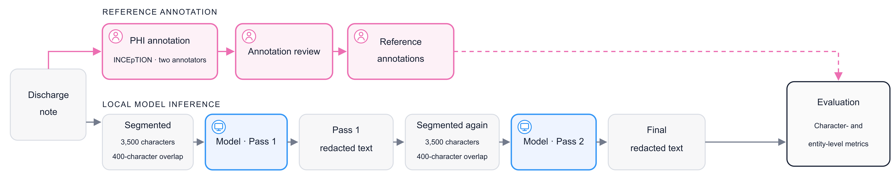

# Local LLM clinical text de-identification

Companion software for *Clinical Text De-identification with Locally Deployed Open-Weight Large Language Models: A Real-World Evaluation of Discharge Notes*, by James Weatherhead, Emily Cwiklik, Peter McCaffrey, and George Golovko. Submitted to *Frontiers in Digital Health* on September 11, 2026.

We evaluated 17 locally deployed open-weight language models on 100 discharge notes. The highest observed character recall was 98.9%, but no model removed every annotated identifier from every note. The highest note-level completeness was 67 of 100 notes. These are results from the study corpus, not the synthetic examples in this repository.

This repository provides a reference implementation derived from the study software, the extraction prompts and schema, scoring and analysis scripts, and synthetic examples. It is not an archive of the original execution code. The manuscript cites [v1.0.1](https://github.com/JamesWeatherhead/local-llm-deid/tree/v1.0.1), which includes post-study validation, rerun-safety, and privacy changes; the study results were not recomputed with that release. Later changes on `main` are recorded in [CHANGELOG.md](CHANGELOG.md).

This is research software, not a validated system for preparing clinical text for release. Predictions can miss identifiers or remove useful text. Agreement with reference annotations does not establish anonymity or preservation of clinical meaning.

## Requirements

The pipeline, scorer, analysis scripts, and tests use Python 3.9 or newer and the standard library. The file-permission controls and shell commands target macOS and Linux; native Windows execution is not tested.

Local model inference additionally requires a compatible `llama-server` from [llama.cpp](https://github.com/ggml-org/llama.cpp) and GGUF weights. Model downloads require network access and the relevant model license permissions. Inference can run locally after the software and weights are installed.

## Quickstart

Start with the offline example; no model weights or GPU are needed:

```bash
git clone https://github.com/JamesWeatherhead/local-llm-deid.git
cd local-llm-deid
make selftest
python3 -m unittest discover -s tests -v
```

`make selftest` runs a rule-based test substitute over three synthetic notes and scores its predictions. It was not used for the manuscript's LLM results. On this fixture it covers 253 of 335 annotated characters, removes no characters outside the reference spans, and leaves no annotated characters visible in one of the three notes. Those numbers describe the test substitute and fixture, not a language model.

Each of these three notes fits within one default segment, so this example does not exercise overlapping windows. The separate [long synthetic example](fixtures/long_synthetic/README.md) demonstrates boundary handling and document-wide matching, including over-redaction of a matching string in a non-identifying context.

`make` is optional. The equivalent Python commands and package installation instructions are in [Usage](docs/USAGE.md).

### Run a local model

This example uses Gemma 3 1B on an Apple Silicon Mac. It is a small checkpoint for trying the software, not a recommendation for clinical use.

```bash
brew install llama.cpp
python3 -m venv .venv
source .venv/bin/activate
python3 -m pip install -U huggingface_hub

hf download ggml-org/gemma-3-1b-it-GGUF \
    gemma-3-1b-it-Q8_0.gguf --local-dir models/gemma-3-1b-it

scripts/run_local_end_to_end.sh \
    --gguf models/gemma-3-1b-it/gemma-3-1b-it-Q8_0.gguf \
    --model-id gemma-3-1b-it \
    --out-dir out/gemma-example
```

The script starts the server, runs both passes, scores the predictions, draws example charts, and stops the server. Runtime and predictions depend on the checkpoint, server build, launch settings, and hardware; the example is not a promise of a particular score or execution time.

Use a new output directory for a separate execution. Replacing an existing model output requires `--overwrite-model-output`. Run `scripts/run_local_end_to_end.sh --help` for options, or see [Usage](docs/USAGE.md) for other models, hardware, and corpora.

## How the pipeline works

The model identifies strings; Python determines their positions. The model is not asked to rewrite the note or return offsets. Offsets throughout the implementation refer to Unicode codepoints in the original note, with half-open `[start, end)` intervals.



*Panel B of manuscript Figure 1. This schematic illustrates the study workflow; the public runner saves prediction offsets rather than final redacted text files.*

### 1. Segment the note

`pipeline.fixed_segments` divides a note into windows of at most 3,500 codepoints with 400 codepoints of overlap. Overlap helps keep identifiers near a boundary available in full in an adjacent segment; it does not guarantee that an arbitrary identifier or all relevant context will fit in a window.

### 2. Request structured extraction

Each segment is submitted with the frozen [system prompt](protocol/system_prompt.txt), [user template](protocol/user_prompt_template.txt), and [JSON schema](protocol/model_output.schema.json). A response has this structure:

```json
{"identifiers": [{"exact_text": "Dana Kim", "identifier_type": "01_NAME"}]}
```

The 18 study-specific categories are based on HIPAA Safe Harbor. The annotation policy includes clinician names, named facilities and care sites used as care locations, and year-only dates directly related to an individual. It is not a claim that these labels reproduce the regulatory categories without study-specific conventions.

Requests specify temperature `0`, seed `42`, and `reasoning_effort: "low"`. These settings do not guarantee identical model outputs across runtimes or hardware, or that every checkpoint interprets the reasoning setting identically. The text operations are deterministic for fixed inputs.

### 3. Validate and locate the strings

The runner distinguishes a usable response from a fully schema-valid response. A usable response is a JSON object containing an identifier list. Individual records are accepted only with the two required fields, a valid type, and a nonempty string occurring verbatim in the supplied segment. Valid records can be retained even when other records or the surrounding response fail stricter checks.

Accepted strings are pooled across segments. `pipeline.resolve_pairs` then finds every exact, case-sensitive substring occurrence in the current full-note representation, including occurrences outside the segment that produced the string. There is no fuzzy matching, normalization, or word-boundary restriction.

This can recover repeated identifiers, but it can also redact a matching string in a non-identifying context elsewhere. Grounding confirms that text occurs in the input; it does not confirm that every occurrence is an identifier.

### 4. Run the second pass

The software replaces Pass 1 regions with `[PHI]`, segments that partially redacted representation, and processes it with the same extraction protocol. New findings are mapped back to the original note. Matches touching an inserted marker are discarded because they cannot map to a contiguous source span.

Pass 2 additions are applied only when every expected Pass 2 segment finishes with `stop` and returns a usable response. Otherwise, the note retains Pass 1 predictions alone. Pass 2 can add a redaction but cannot undo one; strict schema validity is recorded separately and is not the application gate.

Implementation: [run_model.process_document](src/deid/run_model.py).

### 5. Score the prediction offsets

The runner saves offsets and identifier types, not final redacted `.txt` files. `pipeline.neutral_redaction` and `pipeline.typed_redaction` can render text for inspection; the scorer evaluates the offsets directly.

Accuracy metrics use the reference annotation JSON and `resolved_predictions.json`. Character recall is type-agnostic: a reference-identifier character counts as covered by any predicted redaction, regardless of its assigned category. Note-level completeness requires coverage of every annotated identifier character in that note, not proof that no identifying information remains.

Operational and response-format metrics additionally use response telemetry, validation records, and the expected-segment manifests. Conditional response-format rates are not end-to-end success rates. See [DATA_DICTIONARY.md](DATA_DICTIONARY.md) for definitions and the treatment of older outputs without manifests.

## Outputs and sensitive data

The local-model example writes under `out/gemma-example/`:

| Path | Contents |
| --- | --- |
| `predictions/<model>/resolved/` | Pass 1 prediction offsets and types. |
| `predictions/<model>/pass_2/resolved/` | Cumulative predictions after the Pass 2 application rule. |
| `predictions/<model>/inference_manifest.json` | Run settings, code and protocol hashes, and available checkpoint/server provenance. |
| `predictions/<model>/expected_segments/` and `pass_2/expected_segments/` | Per-note segment plans, saved before the requests for each pass. |
| `raw_responses/` and `validation/`, within each pass directory | Response telemetry and validation outcomes. |
| `metrics_long.csv`, `per_doc_long.csv` | Aggregate metrics and per-note counts. |
| `model_manifest.csv`, `run_manifest.json` | Model metadata and scoring definitions. |
| `figures/` | SVG charts and their plotted values as CSV. These are not the manuscript's figure images. |
| `llama-server.log` | Server output; inspect and protect it separately from response telemetry. |

Generated response text is omitted from runner artifacts by default. Retaining it requires both `--retain-raw-content` and `--acknowledge-phi-risk`; on real notes it may repeat identifiers. Even without literal text, document IDs, source hashes, counts, paths, and model/server metadata can be sensitive. Keep all outputs in approved storage; `.gitignore` is not an access control.

The runner uses private file permissions and refuses to reuse model output directories without an explicit overwrite. The shell launcher accepts loopback endpoints only. Direct Python use can accept an HTTPS remote endpoint with `--allow-remote-api`; that option does not establish institutional authorization. Server logs and any separately rendered text require their own review. See [SECURITY.md](SECURITY.md).

## What can be reproduced

The public examples exercise the implementation on synthetic inputs. The analysis scripts can process suitably formatted outputs, but the repository alone cannot reproduce the study's numerical results. The clinical notes, independent and consensus annotations, and retained study responses are not distributed here. Exact checkpoint provenance is also incomplete for 16 models, and the exact `llama.cpp` source revision and build flags were not preserved in the available study record.

New runs record more provenance than the original public snapshot. Those records describe the new execution; they do not recover missing study metadata or establish that a supplied endpoint loaded the claimed weights. The [reproducibility notes](docs/REPRODUCIBILITY.md) distinguish the study record, the cited release, and current behavior.

The study used 100 clinician-authored UTMB discharge notes from 2021, with 3,537 consensus identifier spans across nine study categories. Two HIPAA-trained reviewers independently annotated the notes and reconciled disagreements. The 20 calibration notes and 10 reserve notes were not part of the reported test-set estimates. The public examples are not substitutes for external clinical validation.

### Data access

The source notes, independent and consensus annotation exports, and raw model responses contain or reproduce protected health information and are governed by UTMB IRB protocol `26-0014` and institutional privacy restrictions. Researchers may request access for a proposed project, but access requires the applicable UTMB IRB and institutional review, applicable HIPAA authorization or waiver requirements, and any required agreements. The authors cannot authorize access alone. Contact James Weatherhead at `jacweath@utmb.edu` for information about initiating review.

## Further documentation

- [Usage](docs/USAGE.md): installation, other hardware, model selection, and evaluating your own notes.
- [Reference annotations](docs/ANNOTATIONS.md): INCEpTION setup, export format, and example JSON.
- [Model checkpoints](docs/MODELS.md): the 17 study checkpoints and available provenance.
- [Analysis scripts](docs/ANALYSIS.md): tables, figures, and matched three-execution bootstrap inputs.
- [Manuscript map](docs/MANUSCRIPT_MAP.md): methods, metrics, tables, figures, and analyses outside this repository.

## Citation and license

When using this work, cite the accompanying manuscript and the software commit or release actually used. [CITATION.cff](CITATION.cff) describes the cited `v1.0.1` release; changes on `main` do not replace that snapshot.

The software is MIT licensed; see [LICENSE](LICENSE). Model weights have separate terms listed in [THIRD_PARTY_NOTICES.md](THIRD_PARTY_NOTICES.md).
