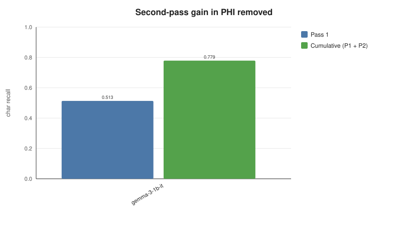
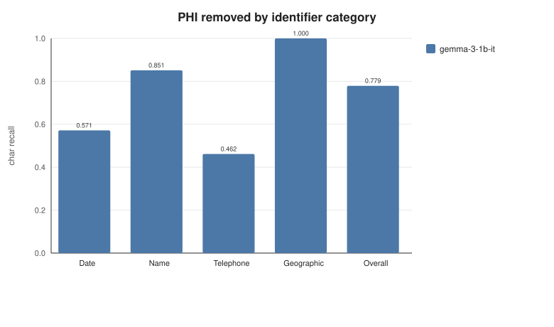
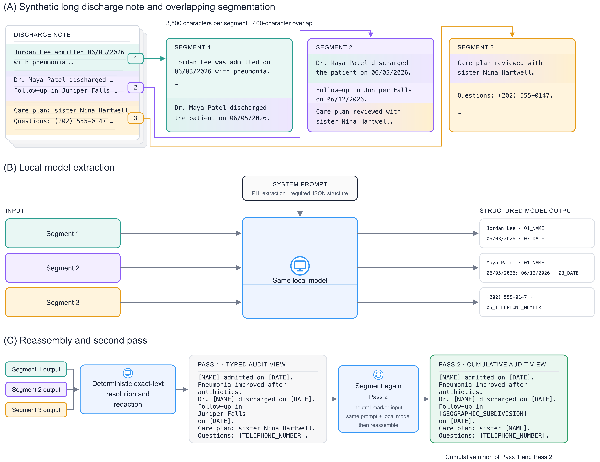

# Analysis scripts

The scripts below read scorer outputs, not clinical model responses. They can
run against the synthetic example and compatible controlled-access outputs.
The public examples do not reproduce the manuscript's numerical results.

## Tables

```bash
# Reference-corpus counts from the supplied annotations
python3 scripts/make_corpus_table.py --gold-dir fixtures/synthetic/gold

# Recorded checkpoint metadata
python3 scripts/make_checkpoints_table.py

# Scorer-derived result fields for one execution
python3 scripts/make_results_table.py --metrics out/metrics_long.csv
```

The corpus script summarizes the annotations supplied to it; it cannot reconstruct
the study's source-corpus selection funnel from the synthetic notes. The
checkpoint table uses the committed model metadata. The results table ranks the
supplied models by cumulative character recall. The ranking is descriptive of
those inputs, not a general model recommendation.

The manuscript reports means over three separate stability executions. For
matched outputs, repeat `--metrics`:

```bash
python3 scripts/make_results_table.py \
    --metrics run1/metrics_long.csv \
    --metrics run2/metrics_long.csv \
    --metrics run3/metrics_long.csv
```

The helper matches row keys and model metadata before averaging numeric outcomes.
These are separate executions of the same notes, not additional independent
notes. The scorer does not aggregate the manuscript's median-seconds-per-note
column, and the result-table helper does not invent missing confidence limits.

## Confidence intervals

```bash
python3 scripts/bootstrap_ci.py --per-doc out/per_doc_long.csv
```

With three synthetic notes, this is only an execution example. For the
manuscript's three-execution preparation, supply all three matched per-note files:

```bash
python3 scripts/bootstrap_ci.py \
    --per-doc run1/per_doc_long.csv \
    --per-doc run2/per_doc_long.csv \
    --per-doc run3/per_doc_long.csv
```

The script checks matching model/pass/note keys and invariant reference counts,
averages stored counts and completeness indicators by note across executions,
then resamples notes with replacement. It uses 10,000 resamples, seed `20260801`,
and the 2.5th and 97.5th percentiles. Intervals reflect note-sampling variability,
not model-run variability. Reproducing published intervals requires the original
restricted per-note outputs.

## Figures

```bash
python3 scripts/make_figures.py \
    --metrics run1/metrics_long.csv \
    --metrics run2/metrics_long.csv \
    --metrics run3/metrics_long.csv \
    --out-dir out/figures
```

One `--metrics` argument is also accepted for a single execution. Each figure is
written as SVG plus a CSV of its plotted values. These are repository-specific
renders of the analyses associated with manuscript Figures 2–6, not copies of
the submitted figure images. They use the cumulative two-pass, all-expected-note
view, with Pass 1 added where required by the comparison.

| Output | Analysis |
| --- | --- |
| `figure2` | Character recall and note-level completeness. |
| `figure3` | Character recall versus the proportion of redacted characters outside reference spans. |
| `figure4` | Any/full span coverage and relaxed/strict boundary agreement. |
| `figure5` | Pass 1 versus cumulative Pass 2 character recall. |
| `figure6` | Category-specific recall and pooled overall recall. |

Previously generated illustrations under [images/figures](images/figures) show
Gemma 3 1B on the three-note synthetic fixture, not the 17-model clinical study.
Their stored second-pass example has recall 0.513 before and 0.779 after Pass 2;
these values are an illustration, not an expected result for every new model run.





The methods schematics are separate, fixed images. Supplementary Figure S1
illustrates segmentation, extraction, and reassembly:



## Scope

The implementation does not include the independent-annotation agreement
analyses, the separate Presidio baseline, or the published timing aggregation.
The [manuscript map](MANUSCRIPT_MAP.md) identifies these boundaries. `make all`
runs the offline fixture, tables, intervals, charts, and tests; it does not
reproduce the clinical study simply because all commands finish successfully.
