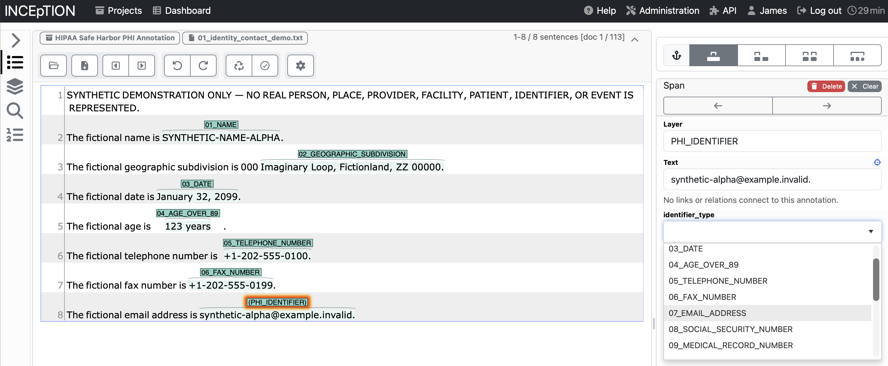

# Reference annotations

The study used [INCEpTION](https://inception-project.github.io) for independent
span annotation and consensus review. The scorer reads the resulting
PubAnnotation JSON format. It does not require INCEpTION to be installed at
scoring time; annotations from another source must satisfy the same format and
offset convention.

## INCEpTION setup

Install INCEpTION locally following its project documentation. Import UTF-8 text
files, one note per document. Create a span layer named `PHI_IDENTIFIER` with a
feature named `identifier_type`. Use the exact category labels from
[model_output.schema.json](../protocol/model_output.schema.json).

These are the study's 18 categories based on HIPAA Safe Harbor, not an unmodified
regulatory list. The policy also includes clinician names, named facilities or
care sites used as care locations, and individual-related year-only dates. The
full selection and boundary rules are in the unchanged
[system prompt](../protocol/system_prompt.txt).

Highlight each identifier span and assign its category. In the study, two
HIPAA-trained reviewers annotated independently and resolved disagreements by
consensus. Simply importing text or exporting one annotator's work does not
reproduce that reference-standard process.



## Export format

From the document toolbar, choose:

```text
PubAnnotation Document with Annotations (JSON)
```


Save one `<doc-id>.json` file per note. Each file includes the source `text`,
`denotations` for the selected spans, and `attributes` assigning types to those
spans. The loader joins each attribute's `subj` to a denotation's `id`.

```json
{
  "sourcedb": "synthetic-example",
  "sourceid": "EXAMPLE001",
  "text": "Patient: Dana Kim\n",
  "denotations": [
    {
      "id": "T1",
      "obj": "PHI_IDENTIFIER",
      "span": {"begin": 9, "end": 17}
    }
  ],
  "attributes": [
    {
      "id": "A1",
      "subj": "T1",
      "pred": "identifier_type",
      "obj": "01_NAME"
    }
  ]
}
```

Here `text[9:17]` is exactly `Dana Kim`. Offsets consumed by this scorer are
Unicode codepoints, not bytes, with inclusive starts and exclusive ends. Verify
that exports use these coordinates, especially when text contains non-ASCII or
supplementary Unicode characters. Do not normalize text or change line endings
after annotation without checking the offsets and the runner's source hash.
The scorer's reference text must match the string processed by the runner.

Complete examples are in [fixtures/synthetic/gold](../fixtures/synthetic/gold).
Supply only the intended identifier layer and confirm that every annotation has
the correct type; `metrics.load_gold` is a format loader, not a clinical review
of annotation completeness.

## Citation

Klie, J.-C., Bugert, M., Boullosa, B., Eckart de Castilho, R., and Gurevych, I.
(2018). *The INCEpTION Platform: Machine-Assisted and Knowledge-Oriented
Interactive Annotation*. Proceedings of the 27th International Conference on
Computational Linguistics: System Demonstrations, 5–9.
[Paper](https://aclanthology.org/C18-2002/).
